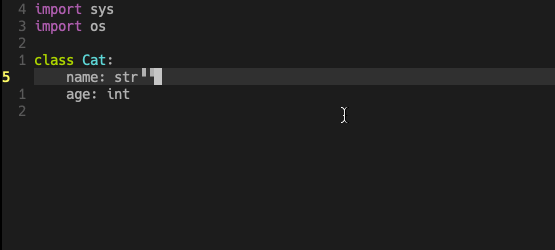
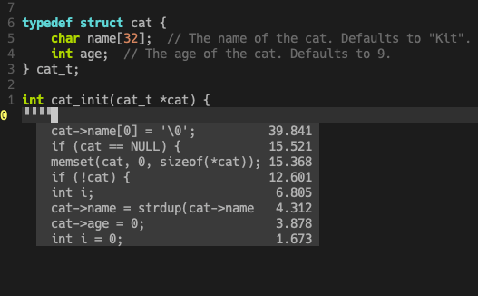
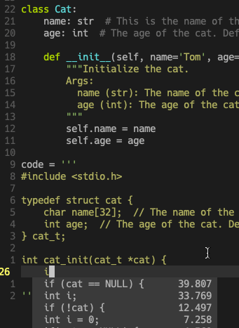

# ICY
ICY(I Complete You) is an all-language autocompleter inspired by [TabNine](https://tabnine.com/). ICY uses deep learning to help you write things faster. In theory, it works for any language (not only for Programing Languages).

### Preview







### Try it

Requirements:

- Python3.6+
- tensorflow-gpu 2.0+
- Vim8 with python3 enabled.

Setup:

```bash
# install and run the server
git clone https://github.com/icy-room/icy.git
cd icy
pip install -e .
mkdir -p ~/.icy
echo "http://localhost:10086/completions" > ~/.icy/serverurl
icys

# install vim extension
git clone https://github.com/icy-room/icy-vim.git ~/icy-vim
cat >> ~/.vimrc <<EOF
set rtp+=~/icy-vim
EOF
```

### How it works

That's super simple. ICY use the GPT2 model + beam search to search completion candidates. 

### Current State

ICY is in a very *early* development stage and can not be considered usable now. 

Only a small piece of context in front of the cursor is looked. No indexes. A Cuda GPU is required to get acceptable lower latency...

There are tons of works to do to make it usable. Contributions are always welcome. If you have any idea, feel free to fire issues or send PRs.

